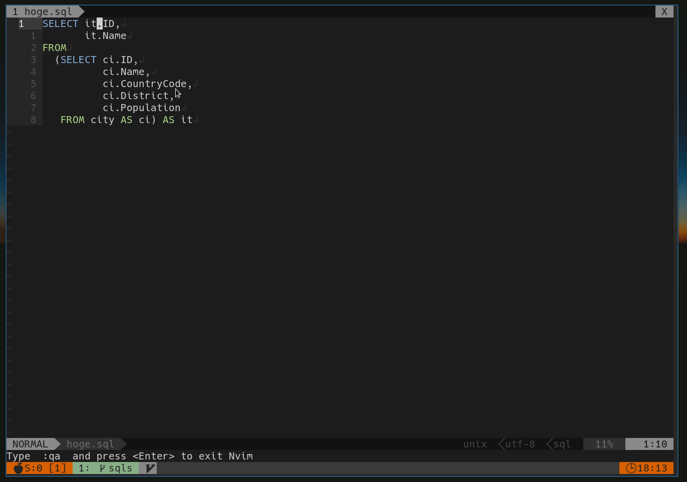

# sqls


An implementation of the Language Server Protocol for SQL.

## Note

This project is currently under development and there is no stable release. Therefore, destructive interface changes and configuration changes are expected.

## Features

sqls aims to provide advanced intelligence for you to edit sql in your own editor.

### Support RDBMS

- MySQL([Go-MySQL-Driver](https://github.com/go-sql-driver/mysql))
- PostgreSQL([pq](https://github.com/lib/pq))
- SQLite3([go-sqlite3](https://github.com/mattn/go-sqlite3))

### Language Server Features

#### Auto Completion


- DML(Data Manipulation Language)
    - [x] SELECT
        - [x] Sub Query
    - [x] INSERT
    - [x] UPDATE
    - [x] DELETE
- DDL(Data Definition Language)
    - [ ] CREATE TABLE
    - [ ] ALTER TABLE

#### CodeAction


- [x] Execute SQL
- [ ] Explain SQL
- [x] Switch Connection(Selected Database Connection)
- [x] Switch Database

#### Hover



#### Document Formatting

Coming soon.

## Installation

```
go get github.com/lighttiger2505/sqls
```

### Editor Plugins

- [sqls.vim](https://github.com/lighttiger2505/sqls.vim)
- [vscode-sqls](https://github.com/lighttiger2505/vscode-sqls)

### DB Configuration (For the Language Server Client)

Connecting to an RDBMS is indispensable for using sqls.
sqls connects to the RDBMS at [initialization](https://microsoft.github.io/language-server-protocol/specifications/specification-current/#initialize), using the DB setting of `initializationOptions` set in your Language server client.

Below is a setting example with vim-lsp.
**I'm sorry. Please wait a little longer for other editor settings.**

```vim
if executable('sqls')
    augroup LspSqls
        autocmd!
        autocmd User lsp_setup call lsp#register_server({
        \   'name': 'sqls',
        \   'cmd': {server_info->['sqls']},
        \   'whitelist': ['sql'],
        \   'workspace_config': {
        \     'sqls': {
        \       'connections': [
        \         {
        \           'driver': 'mysql',
        \           'dataSourceName': 'root:root@tcp(127.0.0.1:13306)/world',
        \         },
        \         {
        \           'driver': 'postgresql',
        \           'dataSourceName': 'host=127.0.0.1 port=15432 user=postgres password=mysecretpassword1234 dbname=dvdrental sslmode=disable',
        \         },
        \       ],
        \     },
        \   },
        \ })
    augroup END
endif
```

#### MySQL

```vim
{'driver': 'mysql', 'dataSourceName': 'mysql:mysqlpassword@tcp(127.0.0.1:3306)/world'}
```

See also. https://github.com/go-sql-driver/mysql#dsn-data-source-name

#### PostgreSQL

```vim
{'driver': 'postgresql', 'dataSourceName': 'host=127.0.0.1 port=5432 user=postgres password=postgrespassword dbname=world sslmode=disable'}
```

See also. https://godoc.org/github.com/lib/pq

#### SQLite3

```vim
{'driver': 'sqlite3', 'dataSourceName': 'file:chinook.db'}
```

See also. https://github.com/mattn/go-sqlite3#connection-string

## Special Thanks

[@mattn](https://github.com/mattn)

## Inspired

I created sqls inspired by the following OSS.

- [dbcli Tools](https://github.com/dbcli)
    - [mycli](https://www.mycli.net/)
    - [pgcli](https://www.pgcli.com/)
    - [litecli](https://litecli.com/)
- non-validating SQL parser
    - [sqlparse](https://github.com/andialbrecht/sqlparse)
